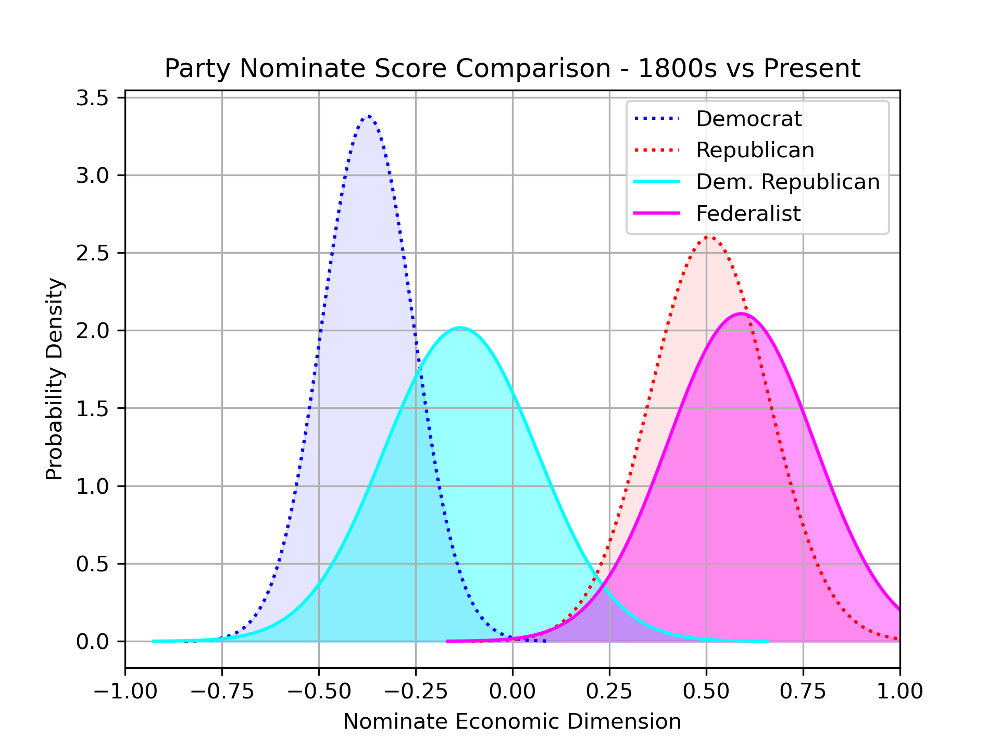

# Final Project - Big Data Tools & Techniques
**Matt Austen**\
**Prof. Ganesh Chandrasekaran**\
**Spring 2024**

---
## Overview

This project uses data from [Voteview.com](https://voteview.com/) to make visualizations of the United States Congress ideology since the 1st Congress in the late 18th century. The data is aggregated and processed using **python** and stored in a **neo4j** database. A key component of the data is "NOMINATE scores", which are metrics that attempt to quantify political ideology. 

#### NOMINATE Scores

In political data analysis, Nominate scores, also known as NOMINATE (NOMINAl Three-step Estimation) scores, are a method used to estimate the ideological positions of legislators based on their voting behavior. These scores provide a quantitative measure of a legislator's political ideology, in VoteView's case, along 2 dimensions:
1. **Dimension 1** of Nominate scores typically represents the left-right ideological spectrum or the *economic dimension*. A higher score on Dimension 1 indicates a more conservative or right-leaning position, while a lower score indicates a more liberal or left-leaning position. 
2. **Dimension 2** of Nominate scores often represents the *social or cultural dimension*. It captures ideological differences that may not be fully captured by Dimension 1.

Legislators with similar Dimension 1 or 2 scores are considered to have similar ideological positions on economic or social/cultural issues. These scores were developed by political scientists Keith Poole and Howard Rosenthal in the 1980s and are calculated based on roll-call votes of legislators relative to each other.

---
## Visualizations

### Data Preparation

`part0_DataPrep.ipynb`

This Python Notebook loads data directly from [VoteView's data page](https://voteview.com/data) and prepares it for processing. Specifically, it performs two tasks:
1. Loads data from VoteView (or locally) and outputs size of dataframes
2. Aggregates VoteView data into one dataframe and computes additional metrics

### Part 1 - NOMINATE Scores Over Time

`python part1_ScatterPlot.py`

This script plots the NOMINATE scores of all members of Congress (both chambers) over time. A plot is generated for each Congress from the 1st in 1789 to the current in 2024. The color is determined by the average NOMINATE dimension 1 score of each member's respective party.

*MP4 file availble in repo*

### Part 2 - Average Voting Probability Over Time

`python part2_LineGraph.py`

This script uses the computed value 'prob_nom' which is the average estimated probability that a member making the vote would make the vote they made. A higher probability suggests a member voted with the majority of their own party, whereas a lower percentage suggests a member was more willing to vote against their own party at times. This is calcualted separately for the House and Senate and is show over time.

### Part 3 - Probability Density Party Comparison (1800 vs 2023)

`python part3_PartyMapping.py`

This script calculated and mean and standard deviation of selected sets of legislators' Nominate scores (dimension 1 only) and plots normal curves aggregated over certain parties. Specifcally, the script plots the Democratic and Republican party of modern day AND the Federalist and Democratic Republican parties of approx. 1800. Three sessions of congress are used for each party (i.e. Federalist Party is represented by Congress 5, 6, and 7).

